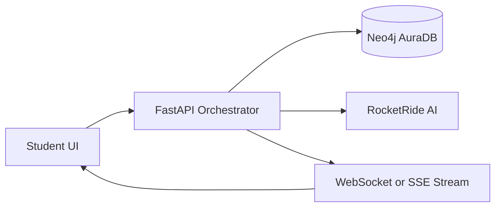
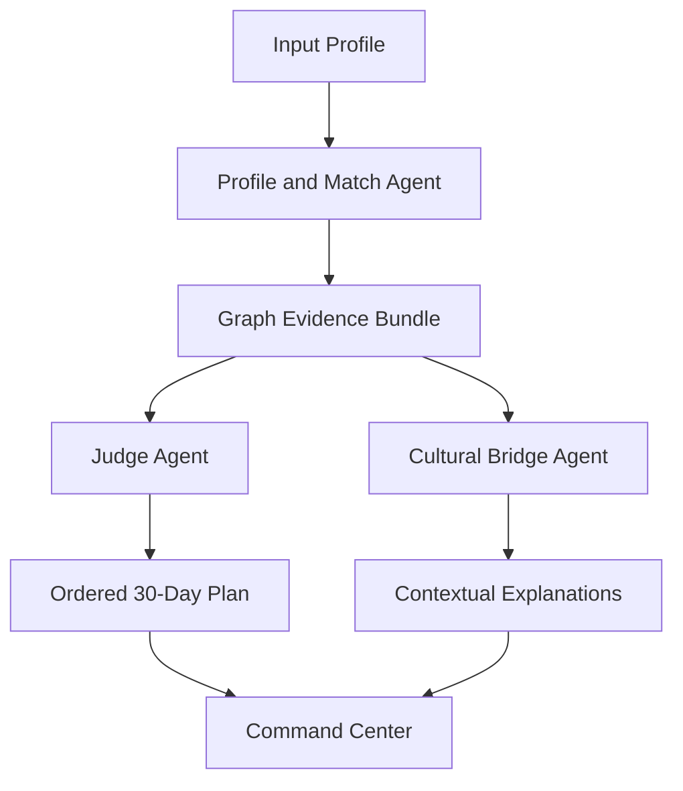

# GlobalBuddy Architecture

## 1. System Overview
GlobalBuddy uses a backend-orchestrated multi-agent pipeline.

## 2. Agent Orchestration

## 3. Runtime Data Flow
1. Frontend posts profile.
2. Backend executes Neo4j queries for mentors, peers, restaurants, events, resources.
3. Backend computes ranking and confidence metadata.
4. Backend passes evidence bundle to RocketRide Judge Agent.
5. Judge returns ordered plan with citations to graph entities.
6. Frontend renders graph and cards incrementally via stream.

## 4. Subsystems
- Frontend (React + vis.js)
  - Profile form
  - Live graph visualization
  - Match cards
  - Timeline plan view
  - Cultural bridge drawer
- Backend (FastAPI)
  - Request validation
  - Agent orchestration
  - Neo4j query service
  - RocketRide prompt service
- Data (Neo4j AuraDB)
  - Relationship-first data model
  - Task dependency graph
- AI (RocketRide)
  - Judge narrative synthesis
  - Cultural term translation and analogies

## 5. Non-Functional Architecture Notes
- Use timeouts and retries around AI calls.
- Log evidence IDs used in generated plan for auditability.
- Keep ranking deterministic before narrative generation.
