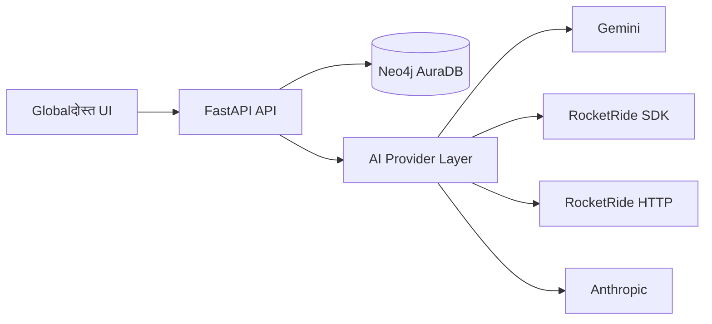
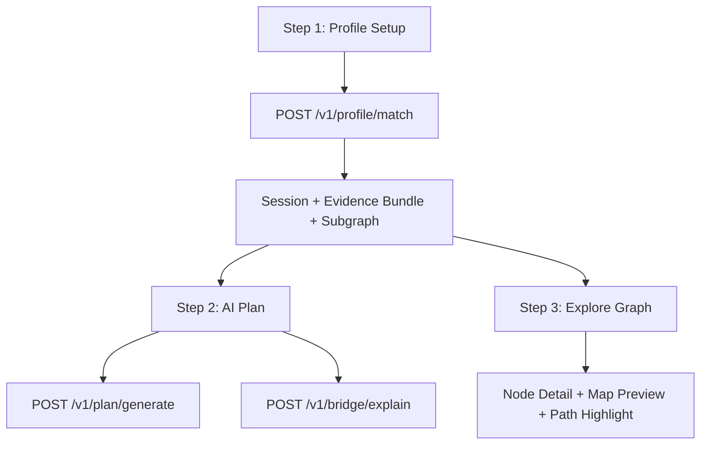

# Globalदोस्त Architecture

## 1. System overview
Globalदोस्त uses a backend-orchestrated graph + AI pipeline with a React guided journey UI.

## 2. Product journey architecture

## 3. Runtime data flow
1. User submits profile in Step 1.
2. Backend queries Neo4j for mentors, peers, resources, events, and city-local lists.
3. Backend computes deterministic scores and stores session-scoped evidence/subgraph.
4. Plan endpoint generates ordered steps through selected provider (or deterministic fallback).
5. Bridge endpoint explains terms through selected provider (or deterministic fallback).
6. Explore workspace uses `subgraph` and card metadata for category browsing and node focus.

## 4. Frontend subsystems (implemented)
- Guided 3-step shell with lock/unlock state.
- Profile wizard with required-field step gating.
- Plan timeline with week grouping, completion tracking, and source-node jump.
- Cultural Bridge drawer with retry and quick terms.
- Explore workspace with category pills and person profile modal.
- vis-network graph with filters, shortest-path labeling, and expandable canvas.
- Status pills backed by `/health` and `/health/neo4j`.

## 5. Backend subsystems (implemented)
- FastAPI routers: `profile`, `plan`, `bridge`, `graph`.
- Session store used to persist evidence and graph between steps.
- Neo4j client for read/write and seed script support.
- Provider factory selecting Gemini/RocketRide/Anthropic path from config.
- Citation checks and deterministic fallback strategy.

## 6. Data and safety notes
- Neo4j is the source of truth for graph entities and relationships.
- Local place/event/transit items are guidance nodes, not live feeds.
- UI and generated text should keep verification language for time-sensitive details.
