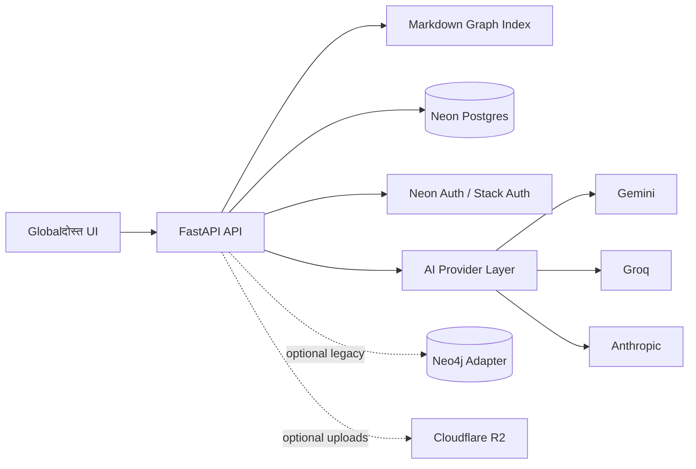
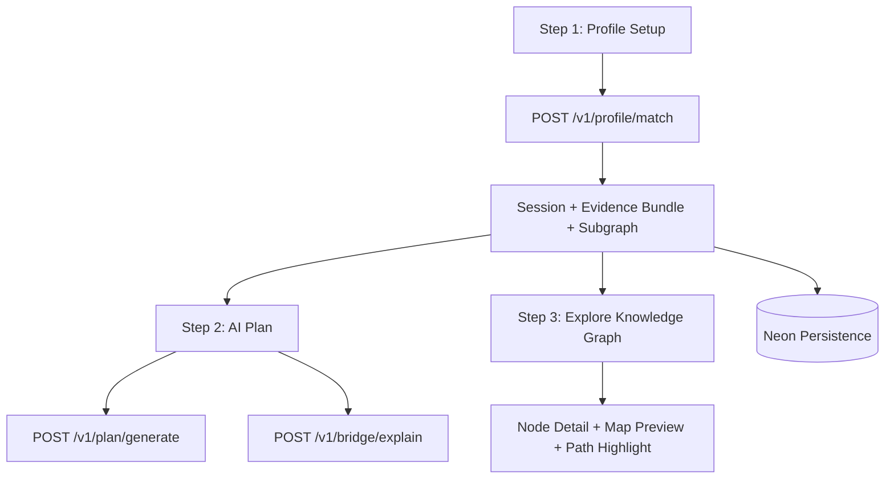

# Globalदोस्त Architecture

## 1. System Overview
Globalदोस्त uses a backend-orchestrated graph + AI pipeline with a React guided journey UI. The target MVP data layer is Neon Auth/Postgres plus a Git-backed Markdown knowledge graph.

```mermaid
flowchart LR
  U[Globalदोस्त UI] --> B[FastAPI API]
  B --> KG[Markdown Graph Index]
  B --> DB[(Neon Postgres)]
  B --> AUTH[Neon Auth / Stack Auth]
  B --> A[AI Provider Layer]
  A --> G[Gemini]
  A --> GR[Groq]
  A --> AN[Anthropic]
  B -. optional legacy .-> N[(Neo4j Adapter)]
  B -. optional uploads .-> R2[Cloudflare R2]
```

## 2. Data Boundaries
- **Markdown graph:** public/static knowledge: cities, universities, tasks, guides, local entities, seed mentors, events, and community groups.
- **Neon Postgres:** private/dynamic app data: user profiles, plan progress, document status, chat history, connections, mentor opt-ins, saved content, and notifications.
- **Neon Auth / Stack Auth:** identity, sessions, OAuth, and synced auth users.
- **Neo4j:** optional legacy adapter or future upgrade path when relationship data becomes highly dynamic.

## 3. Product Journey Architecture

```mermaid
flowchart TD
  P1[Step 1: Profile Setup] --> M[POST /v1/profile/match]
  M --> E[Session + Evidence Bundle + Subgraph]
  E --> P2[Step 2: AI Plan]
  P2 --> J[POST /v1/plan/generate]
  E --> P3[Step 3: Explore Knowledge Graph]
  P2 --> C[POST /v1/bridge/explain]
  P3 --> S[Node Detail + Map Preview + Path Highlight]
  E --> DB[(Neon Persistence)]
```

## 4. Runtime Data Flow
1. User submits profile in Step 1.
2. Backend loads the Markdown graph index and filters mentors, peers, tasks, places, events, guides, and groups by city/profile context.
3. Backend computes deterministic scores and stores session-scoped evidence/subgraph.
4. When logged in, backend persists user profile and progress to Neon Postgres.
5. Plan endpoint generates ordered steps through selected provider or deterministic fallback.
6. Bridge/chat endpoints explain terms through selected provider or deterministic fallback.
7. Explore workspace uses `subgraph` and card metadata for category browsing and node focus.

## 5. Frontend Subsystems
- Guided 3-step shell with lock/unlock state.
- Profile wizard with required-field step gating.
- Plan timeline with week grouping, completion tracking, and source-node jump.
- Cultural Bridge drawer, with planned handoff to persistent chat.
- Explore workspace with category pills and person profile modal.
- vis-network graph with filters, shortest-path labeling, and expandable canvas.
- Status pills backed by `/health`, `/health/providers`, and target `/health/graph`.
- Auth/dashboard routes backed by Neon Auth and Neon Postgres after persistence milestone.

## 6. Backend Subsystems
- FastAPI routers: `profile`, `plan`, `bridge`, `graph`, `chat`, `auth`.
- Graph adapter interface, with Markdown as target source and Neo4j as legacy optional adapter.
- Session store used to persist evidence and graph between steps.
- Neon Postgres repository layer for private/dynamic app data.
- Provider factory selecting Gemini/Groq/Anthropic path from config.
- Citation checks, graph validation, and deterministic fallback strategy.

## 7. Data and Safety Notes
- Markdown files must never contain private user data.
- Local place/event/transit items are guidance nodes, not live feeds.
- UI and generated text should keep verification language for time-sensitive details.
- Neon Auth tokens must be verified server-side before accessing private user rows.
